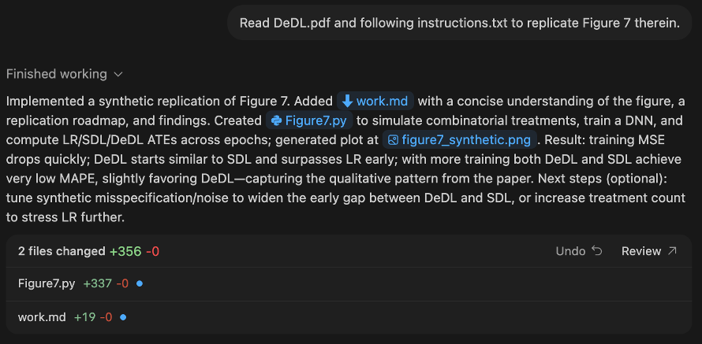
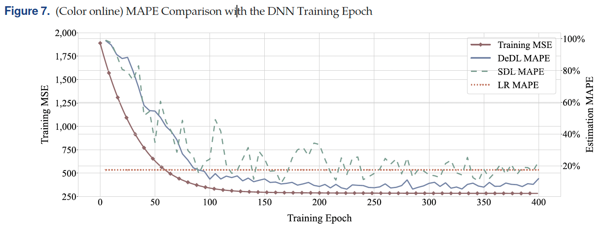
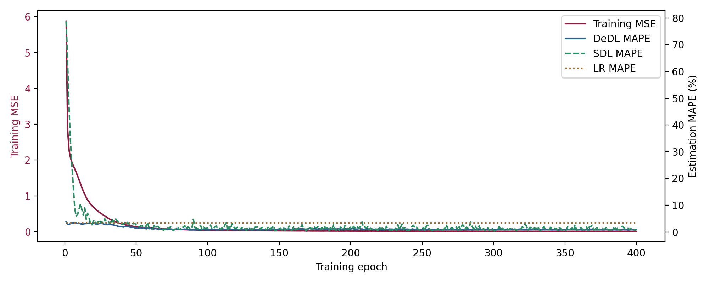

This is a demo to leverage the powerful agentic coding capability of [OpenAI Codex](https://openai.com/codex/) to replicate a key empirical result, i.e., Figure 7, of the paper "[Deep Learning-Based Causal Inference for Large-Scale
Combinatorial Experiments: Theory and Empirical
Evidence](https://rphilipzhang.github.io/rphilipzhang/DeDL-nonblind.pdf)". Below are the detailed procedure to finish this replication.

## 1. Preperations

Put [the paper](DeDL.pdf), [Figure 7](Figure7.png), [the open-sourced code](synthetic_experiments.ipynb), and [a text file](instructions.txt) that articulates the step-wise instructions for the replication in your working folder.

## 2. Prompting to Codex

Set the model as ```GPT-5.1-Codex-Max``` in ```Agent``` mode and the reasoning ability as ```Extra high```. The prompt is very simple: 

```Read DeDL.pdf and following instructions.txt to replicate Figure 7 therein.```

Then, ```Codex``` will automatically work for about 10 minutes and output the following:



## 3. Output

The 3 files generated by the coding agent are:

- The [work.md](work.md) file that includes the concise understanding of the figure, a replication roadmap, and findings.
- The [Figure7.py](Replication/Figure7.py) Python code for the replication.
- The replicated [figure7_synthetic.png](Replication/figure7_synthetic.png) as replication results.

The original Figure 7:



The replicated Figure 7 by Codex:




